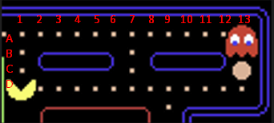
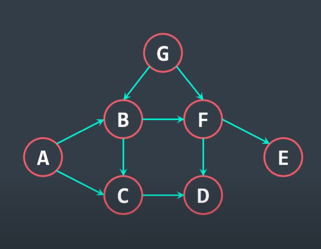

# Resolução de Problemas com Grafos - Unifor 5º semestre
- Execução do algoritmo BFS (Breadth First Search) para encontrar o melhor caminho entre dois pontos.
- Execução do algoritmo de Ordenação Topológica.

## Executar
- BFS (problema do pacman):
<code>node breadth-first-search</code>
- Topological Sort (problema do npm):
<code>node topological-sort</code>

### Matriz/Grafo utilizados
- BFS (problema do pacman):

- Topological Sort (problema do npm):

### Material utilizado:
#### BFS
- https://www.youtube.com/watch?v=j9TM9l8hFRM
- https://acervolima.com/implementacao-de-graph-em-javascript/
#### Topological Sort
- https://www.youtube.com/watch?v=GYmq98CVm2c
- https://www.geeksforgeeks.org/topological-sorting/